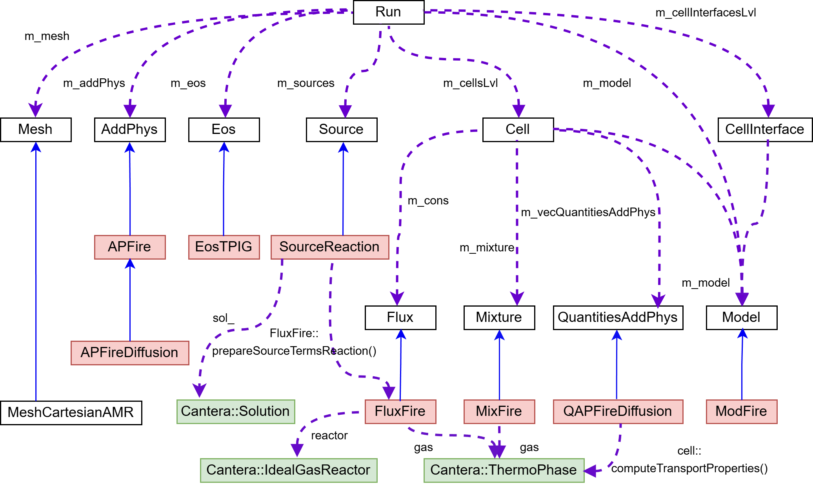

<p align="center">
  

</p>

# Fire - Adaptive Mesh Refinement Solver for Compressible Reacting Flows

**Fire** is an open-source CFD solver specializing in compressible reacting flows, built upon the [ECOGEN-v2.0](https://github.com/code-mphi/ECOGEN/tree/38da6745034a541fa9355ebc57f413c4ac8ef7a4) framework with enhanced combustion modeling capabilities. Key features include:

- 🚀 Advanced AMR strategies for flame and wave front resolution
- 🔥 Integrated Cantera chemistry solver
- 📐 Multi-dimensional simulation support (1D-3D)
- 🧪 Validated against benchmark combustion cases

## Table of Contents
1. [Installation](#1-installation)  
2. [Example Cases](#2-example-cases)  
3. [Post-Processing](#3-post-processing)  
4. [Input File Configuration](#4-input-file-configuration)  
5. [Architecture Overview](#5-architecture-overview)

---

## 1. Installation

### Prerequisites
- Linux OS (Ubuntu 20.04/RedHat tested)
- MPI implementation (OpenMPI recommended)
- Conda package manager
- Cantera 3.1.0 with C++ interface
- cmake 3.10 or higher


### Step-by-Step Setup

1. **Install libcantera-devel 3.0.0b1**
```bash
conda create --name ct --channel cantera/label/dev libcantera-devel==3.0.0b1
```

2. **Install MPI (Ubuntu)**
```bash
sudo apt update && sudo apt install openmpi-bin openmpi-common libopenmpi-dev
```

3. **Build Fire Solver**
```bash
# From any example case directory:
./run.sh [options]

# Available options:
#   --debug    - Debug build
#   -j N       - Use N parallel processes
#   --no-run   - Build only
```

> **Note**  
> The conda environment **must** be named `ct` for automatic build detection

---

## 2. Example Cases

| Case Name                  | Description                                  | Dimensions | Reference |
|----------------------------|----------------------------------------------|------------|-----------|
| `1D_detonation`            | Gaseous detonation wave                     | 1D         | [Paolucci 2014](https://doi.org/10.1016/j.jcp.2014.01.025) |
| `1D_H2-Air_deflagration`            | Gaseous deflagaration wave                     | 1D         | None|
| `2D_ISBI_Case_[1-5]`                  | Inert shock-bubble interaction with different grid setups                 | 2D         | [Ding 2018](https://doi.org/10.1063/1.5050091) |
| `2D_RSBI`                  | Reactive shock-bubble interaction                    | 2D         | [Diegelmann 2016](https://doi.org/10.1016/j.combustflame.2016.09.014) |
| `2D_Channel_detonation_[1-2]`    |  Detonation with cellular structures using HLLC or HLLC-LM schemes          | 2D         | [Paolucci 2014](https://doi.org/10.1016/j.jcp.2014.03.059) |
| `3D_Channel_detonation`    | Large-scale & challenging detonation simulation           | 3D         | None |

**Case Setup Instructions:**
- For each case, the setup files are located in the `input_files/`.
- Detailed instructions can be found in [manuals of ECOGEN-v2.0](https://github.com/code-mphi/ECOGEN/tree/38da6745034a541fa9355ebc57f413c4ac8ef7a4/libTests).

**Avoid spaces in paths**
- Ensure all directory paths (including those for `Fire` or case files) contain no spaces.  
  **Valid example:** `/home/user1/test_case/Fire`  
  **Invalid example:** `/home/user1/test case/Fire`  

**Quick Start:**
```bash
cd example_cases/1D_detonation
./run.sh
```

```bash
cd example_cases/2D_RSBI
./run.sh
```

---

## 3. Post-Processing

Simulation outputs are stored in `results/[Case_Name]/` in the case folder with:

- AMR grid data in `*.vtu` format in `datasets/` folder
- Time metadata in `infoCalcul.out`
- ParaView collection file `collectionParaview.pvd`

Recommended visualization workflow:
- Open `collectionParaview.pvd` in ParaView
- Use `pMax` field for cellular structure analysis
- 1D case results can be plotted using the `plot_1D_*.py` script prepared in the 1D case folders.

---

## 4. Input File Configuration

### Essential Parameters

| Parameter              | Location        | Values          | Description                  |
|------------------------|-----------------|-----------------|------------------------------|
| `riemann_type`         | meshV5.xml      | 1(HLL), 2(HLLC), 3(HLLC-LM) | Inviscid flux scheme selection        |
| `gradRho_flag`         | meshV5.xml      | 0/1             | Turn on/off the 3rd AMR strategy   |
| `lvlHydro`/`lvlChem`   | meshV5.xml      | Integer         | AMR level limits for hydrodynamical and chemical processes |
|`species_diffusion_type`| meshV5.xml      | 0/1, default 0  | 0: conservative species diffusion, 1: pressure variation-dependent species diffusion|
| `strang_splitting_flag`| meshV5.xml      | 0/1, default 1  | 0: turn off Strang splitting; 1: turn on Strang splitting |
| `CanteraInput`         | modelV4.xml     | Path to YAML    | Chemistry configuration      |

### Critical Notes
- The `CanteraInput` in `modelV4.xml` is required even for inert simulations to model the thermodynamic and transport properties.
- The `TOTAL_SPECIES_NUMBER` in CMakeLists.txt shall be the same with the species number in the Cantera file.
- Transport models require `additionalPhysic type="viscosity"`  in `modelV4.xml`

---

## 5. Architecture Overview

### Class Inheritance

- White: ECOGEN base classes
- Red: Fire-specific implementations
- Green: Cantera integrations

### Simulation Workflow
 in Fire.")


Fire-Specific Customizations (Red Highlights):

🔴 Overridden ECOGEN methods for:
- Hydrodynamic processes for the multi-component thermally perfect gas
- Chemical source term integration
- AMR refinement criteria

---

**Acknowledgments**  
This work builds upon the ECOGEN framework. Please cite both projects when using Fire in academic publications.
