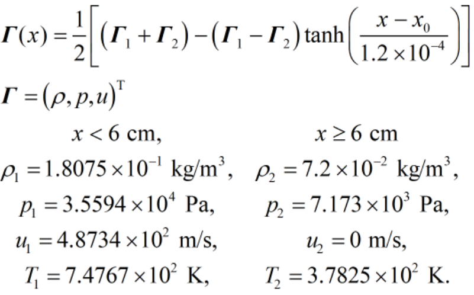
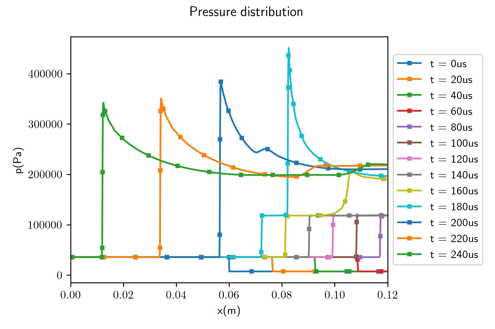
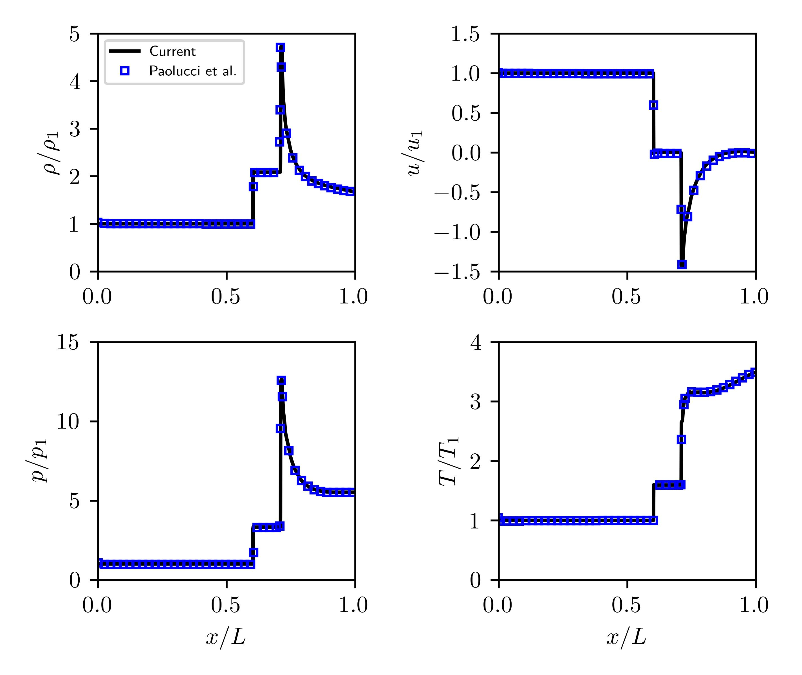

Fire
======
 
The **Fire** solver is an open-source adaptive mesh refinement (AMR) solver for compressible reacting flows. To accurately model compressible multi-component reacting flows, the **Fire** solver employs the thermally perfect gas model for multi-species gaseous mixtures, mixture-averaged transport models for viscous fluxes, and detailed finite-rate chemistry for combustion processes. 

**Notice**: The source code within the `src` directory will be made available upon acceptance of our draft.

# 1. Instructions on building Fire.

The **Fire** solver depends on the [ECOGEN-v2.0](https://github.com/code-mphi/ECOGEN/tree/v2.0) and the Cantera(C++) package. Additionally, the MPI library is required for compilation. This solver has been successfully built and tested on the Ubuntu-20.04 and RedHat systems; therefore, the linux system is recommended for the compilation.

## 1.1 Install the Cantera-3.0.0(C++).

Following the instructions provided by [Cantera](https://cantera.org/install/conda-install.html#development-c-fortran-90-interface), we recommend installing Cantera using conda with the following commands:

```
conda create --name ct-dev --channel cantera/label/dev libcantera-devel
```

C++ header and libraries are installed within the `ct-dev` environment folder, which itself depends on the type of conda installation, and is abbreviated as `path/to/conda/envs` such as:

```
/home/fane/anaconda3/envs/ct-test
```

## 1.2 Install MPI

For the Ubuntu system, OpenMPI can be installed using 

```
sudo apt update
sudo apt install openmpi-bin openmpi-common libopenmpi-dev
```

For the HPC system, MPI might be loaded using the `module load` command.

Please ensure that MPI is correctly installed before building the solver.

## 1.3 Build the Fire solver
The **Fire** solver is built using the `cmake`. 

First, set the `CANTERA_ENV_PATH` on line 5 of the `CMakeLists.txt` to the path of the condas environment containing cantera

```

set(CANTERA_ENV_PATH /home/fane/anaconda3/envs/ct-test)

```

then revise the variable `TOTAL_SPECIES_NUMBER` on line 6 of the `CMakeLists.txt` to the total species number of the gasous mixture for the simulation

```

set(TOTAL_SPECIES_NUMBER 10)

```

after that, build the solver for the release build using

```
$ rm -rf build && mkdir build && cd build && cmake .. && make -j8
```

after the compilation, the executable file is `Fire_Release_#Species`.


or build the solver for the debug build using

```
$ rm -rf build && mkdir build && cd build && cmake -DCMAKE_BUILD_TYPE=Debug .. && make -j8
```

after the compilation, the executable file is `Fire_Debug_#Species`.

Then you can copy the executable file to the root path of `Fire` and run the case. For the release build,

```
$ cd .. 
$ cp build/Fire_Release_#Species ./
$ mpirun -np 8 ./Fire_Debug_#Species
```

# 2. Instructions on running the test cases

We have prepared 4 test cases under the folder `libtests`. Among these, `Detonation_1D` is a 1-dimensional case, and we recommend users to test it first.

## 2.1 Detonation_1D

This test case is from [Paolucci et al.'s work](https://doi.org/10.1016/j.jcp.2014.01.025). 

As the initial conditions are related to the `tanh` function, they cannot be set up properly using the input files alone. The following figure show the initial conditions:



We set the initial condition in the source code in `Cell.cpp`. For initialization,

1. Copy the initial setups to `Cell.cpp`
```
$ cp src/Order1/Cell.cpp_detonation_1D src/Order1/Cell.cpp
```
2. Change the `<testCase>` entry in `ECOGEN.xml` to `./libTests/Detonation_1D/`.
3. Build the solver following the instructions in Section 1. Note that `TOTAL_SPECIES_NUMBER` in the `CMakeLists.txt` shall be set to `9`.
```
$ rm -rf build && mkdir build && cd build && cmake .. && make -j8
$ cd .. && cp build/Fire_Release_9Species ./
```
4. Run the case using the command 

```
./Fire_Release_9Species
```

To facilitate the post-processing of this 1D case, we have prepared two Python scripts to illustrate the temperature and pressure history, located in `results/Detonation_1D_post-process`. 

1. The python script `plot_time.py` plot the developments of pressure and temperature fields, and the pressure development is pictured as:



2. The python script `plot_1D_against_reference.py` demonstrates the comparion between the current results and the results in `results/Detonation_1D_post-process/Paolucci_dat` and shows the AMR grid distribution. The results at 180 us are depicted as:



## 2.2 ISBI_axisymmetric

This is a 2D axisymmetric shock-bubble interaction simulation from [Ding et al.'s work](https://doi.org/10.1063/1.5050091). Note that the total timestep is limited to 2 for illustration purposes, and users are encouraged to modify the `iteration` entry in the `mainV5.xml` to `false` to get more unsteady results of up to 1250 us.

1. Change the `<testCase>` entry in `ECOGEN.xml` to `./libTests/ISBI_axisymmetric/`.
2. Copy the source code for normal initializations to `Cell.cpp`
```
$ cp src/Order1/Cell.cpp_normal src/Order1/Cell.cpp
```
3. Build the solver following the instructions in Section 1. Note that `TOTAL_SPECIES_NUMBER` in the `CMakeLists.txt` shall be set to `3`.
```
$ rm -rf build && mkdir build && cd build && cmake .. && make -j8
$ cd .. && cp build/Fire_Release_3Species ./
```
4. Run the case using the following command for the parallel computation
```
$ mpirun -np 4 ./Fire_Release_3Species
```

## 2.3 RSBI_2D

This is a 2D planar shock-bubble interaction simulation from [Diegelmann et al.'s work](https://doi.org/10.1016/j.combustflame.2016.09.014). Note that the total timestep is limited to 2 for illustration purposes, and users are encouraged to modify the `iteration` entry in the `mainV5.xml` to `false` to get more unsteady results of up to 400 us.

1. Change the `<testCase>` entry in `ECOGEN.xml` to `./libTests/RSBI_2D/`.
2. Copy the source code for normal initializations to `Cell.cpp`
```
$ cp src/Order1/Cell.cpp_normal src/Order1/Cell.cpp
```
3. Build the solver following the instructions in Section 1. Note that `TOTAL_SPECIES_NUMBER` in the `CMakeLists.txt` shall be set to `10`.
```
$ rm -rf build && mkdir build && cd build && cmake .. && make -j8
$ cd .. && cp build/Fire_Release_10Species ./
```
4. Run the case using the following command for the parallel computation
```
$ mpirun -np 4 ./Fire_Release_10Species
```

## 2.4 Channel_detonation_2D

This is an 2D channel detonation simulation from [Paolucci et al.'s work](https://doi.org/10.1016/j.jcp.2014.03.059), and it is set up to simulate from 0 to 500 us.

1. Change the `<testCase>` entry in `ECOGEN.xml` to `./libTests/Channel_detonation_2D/`.
2. Copy the source code for normal initializations to `Cell.cpp`
```
$ cp src/Order1/Cell.cpp_normal src/Order1/Cell.cpp
```
3. Build the solver following the instructions in Section 1. Note that `TOTAL_SPECIES_NUMBER` in the `CMakeLists.txt` shall be set to `9`.
```
$ rm -rf build && mkdir build && cd build && cmake .. && make -j8
$ cd .. && cp build/Fire_Release_9Species ./
```
4. Run the case using the following command for the parallel computation
```
$ mpirun -np 4 ./Fire_Release_9Species
```

# 3. Post-process

The results are located at `results/[Case_name]`. For AMR grids, the results are stored in `*.vtu` form, and a `collectionParaview.pvd` with frame stamps can be read by [Paraview](https://www.paraview.org/) for the post-processing. The time stamp for each frame is recorded in `infoCalcul.out`.

# 4. Entries in input files

We recommend users to read the `libTests/manual*.xml` files to be familiar with the case setups provided by the **ECOGEN** platform. Additionally, we add several entries for the AMR strategies. The worthnoting entries are

- `gradRho_flag` in `meshV5.xml`: a bool variable that turns on/off the strategy 3 for grid-refinement if it is set to 1/0. The strategy 3 is important to capture transverse wave and cellcular structures. The cellular structures are recorded on the root-level grid in the `pMax` field .
- `riemann_type` in `meshV5.xml`: an integral variable that controls the type of approximate Riemann solver for inviscid fluxes: `1` for the HLL solver, `2` for the HLLC solver, and `3` for the HLLC-LM solver.
- `YH2O`, `YCO2`, `YOH` in `meshV5.xml`: bool variables that turn on flame fronts tracking using the strategy 1 for grid-refinement according to the mass fractions of H2O, CO2 and OH, respectively.
- `lvlHydro`, `lvlChem` in `meshV5.xml`: integral variables that limit the maximum AMR level for the hydrodynamic or chemical discontinuities, respectively, which are designed for the AMR strategy 2.
- `name` in `modelV4.xml`: must be set to "Fire". The default solvers of the **ECOGEN** platform, such as `Kapila`,  cannot work as expected, as the advancing procedures and IO functions are specially revised for the **Fire** solver.
- `numberPhases` in `modelV4.xml`: must be set to the number of species of the gaseous mixture for the simulation.
- `CanteraInput` in `modelV4.xml`: have 3 entries. `input_file` should be set to the path of `*.yaml`, `name` shall be the mixture in the `*.yaml` file, and `transport_type`should be set to `Mix`. Note that this entry is required by inert simulations to calculate transport properties.
- `reactionFlag` in `modelV4.xml`: can be commented out or deleted for inert simulations, otherwise, `true` for reactive simulations.
- `additionalPhysic type="viscosity"` in `modelV4.xml`: can be commented out or deleted for inviscid simulations, otherwise, the solver performs viscous simulations and the `Mix` model of the Cantera package is used to evalutate transport properties.